# Survey-data-analysis
## Overview
I conducted a comprehensive data-driven initiative with the primary objective of discerning the nuanced preferences and priorities of merchants in relation to Value-Added Services (VAS). Throughout this analysis, I focused on various dimensions, acknowledging potential divergences between countries, specific merchant verticals, business sizes, and individual respondent profiles.

My analysis delved into crucial aspects such as ranking merchants' prominent pain points, including challenges related to access to credit, seamless technology integration, the quest for loyalty solutions, and the need for efficient accounting and inventory management. I aimed not only to identify what merchants seek but also to assess whether they face difficulties in locating these solutions.

The ultimate goal of my work was to leverage the comprehensive dataset to inform the creation of tailored solutions. By integrating these insights into our offerings, the aim was to meet the unique needs of diverse merchants, thereby enhancing our value proposition and market competitiveness.

Key Questions Explored:

1. I analyzed the Value-Added Services that merchants prioritize.
2. I assessed the willingness of merchants to pay for these services.
3. I investigated how preferences vary across countries, merchant verticals, and business sizes.
4. I ranked and analyzed the primary pain points for merchants, providing insights into their importance.
5. I explored whether merchants are actively seeking solutions for specific challenges, such as credit access, seamless technology, loyalty programs, or accounting/inventory management.

I presented the findings in an informative and interactive Power BI report.

## Data cleaning and preprocessing
The data was in an excel file. The data had survey answers from merchants from different countries, business sizes, and verticals. The survey responses were from more questions unrelated to the study too. I had to select only the required data for the study, clean it, and transform it to get the best insights. I used Excel to perform Exploratory Data Analysis and understand the data better before working on it.

I then used python for data wrangling.

First, I imported all the required modules. I then imported the data using pandas, and set the dataframe's column names correctly  
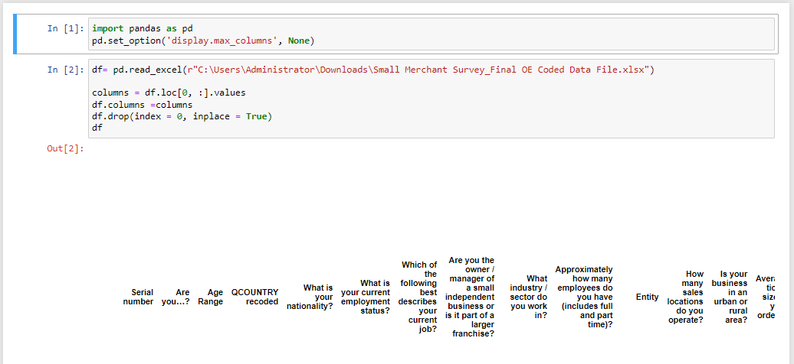     

I then created a new dataframe, a slice of the original dataframe, and named it raw_vas_df. It contained only the data relevant to Value added services only  
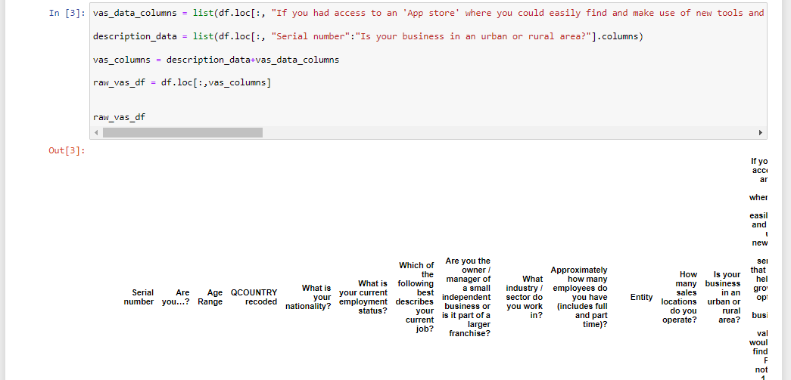     

The column names in this dataframe were the questions asked in the survey. They were really long and not fit for easy reading and understanding for analysis. I hence preceeded to rename the columns for easier reading during analysis.  
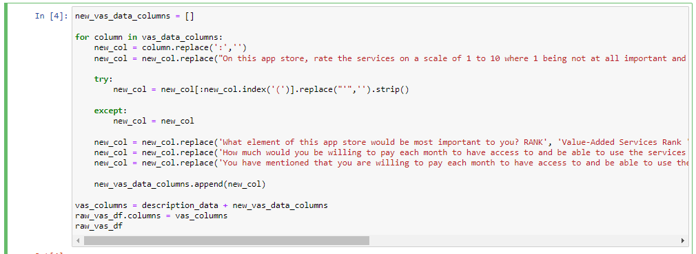     
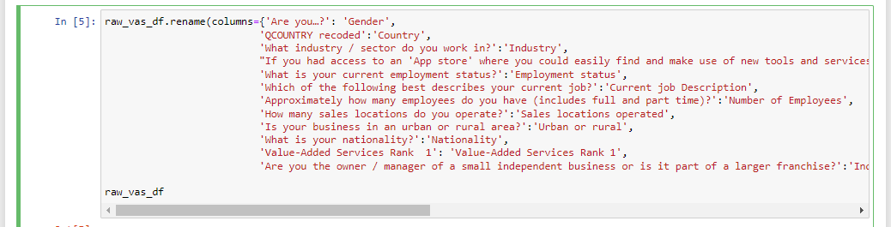     
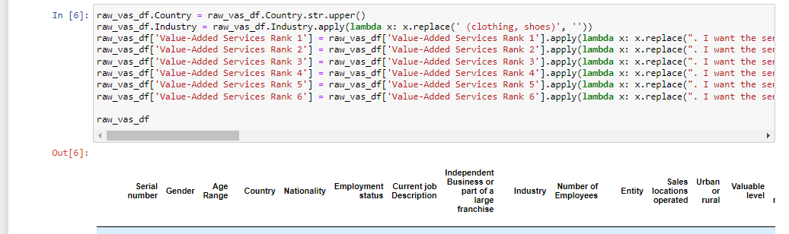     

The raw_vas_df now had clean and easy to read column names ready for transformation. I proceeded to create a dataframe to get the rating of every Value-added Service as rated by each merchant. I stored this transformed data in a dataframe called rating_df  
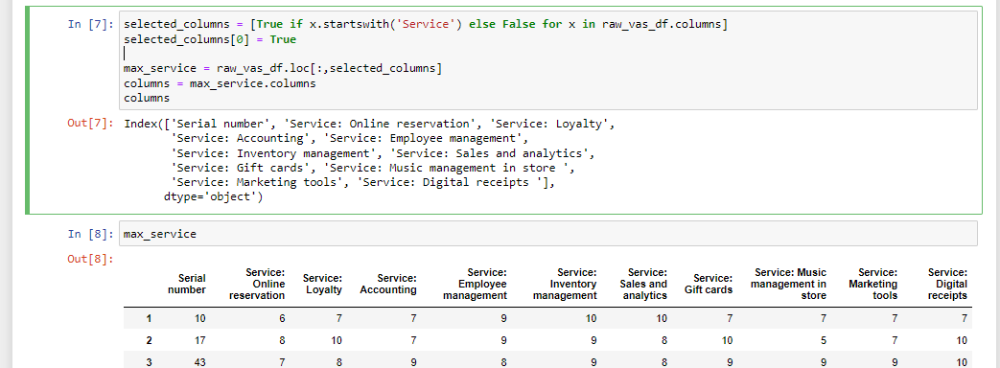     
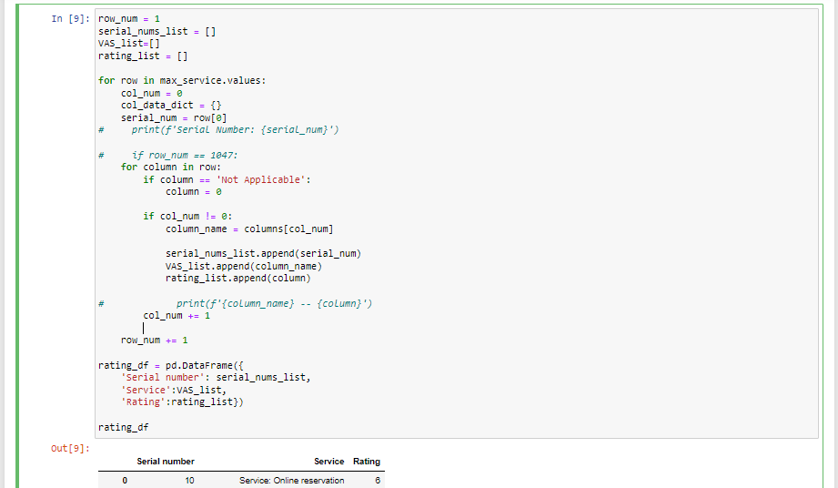     
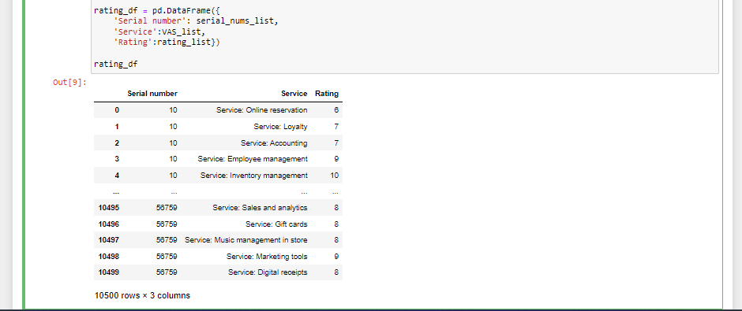     

I also created another dataframe to get the rating of merchants' pain points as rated by each merchant. I stored this transformed data in a dataframe called pain_points_df  
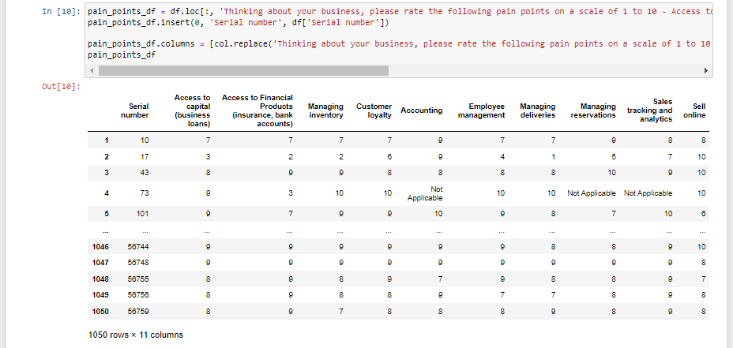     
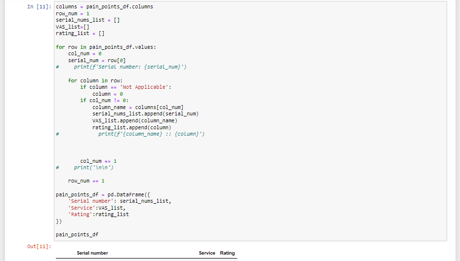     
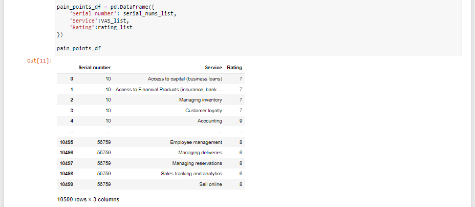     

Finally, I also created the last dataframe to get the challenges faced by merchants. I stored this data in a dataframe called challenges_df  
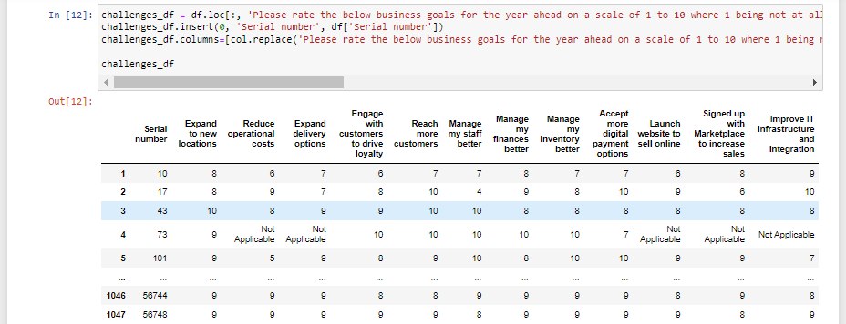     
     
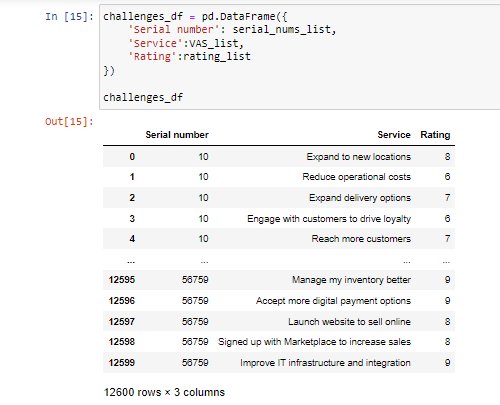     

The data was now well structured, cleaned, transformed, wrangled, and well modelled for creating visualizations. I then proceeded to Power BI for to visualize the data

## Data visualization in Power BI
I imported the data into Power BI using the python script method. The data was already preprocessed so there was nothing much to do in power Query apart from ensuring the data has the correct column names and data types. 
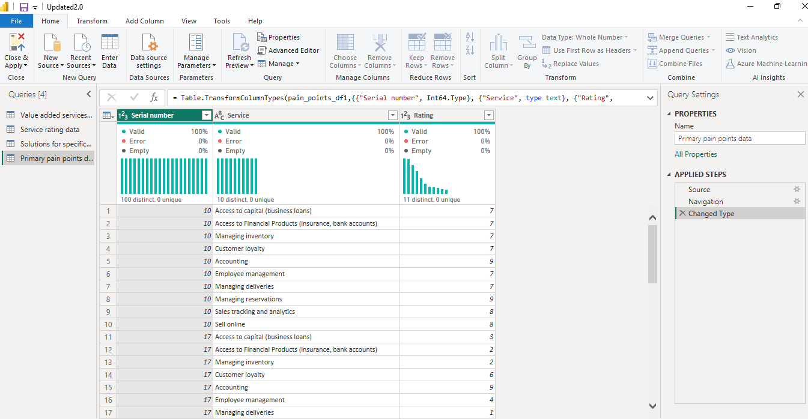     

I then ensured that all the tables had the correct and active relationships between them so that the insights were accurate and interactive  
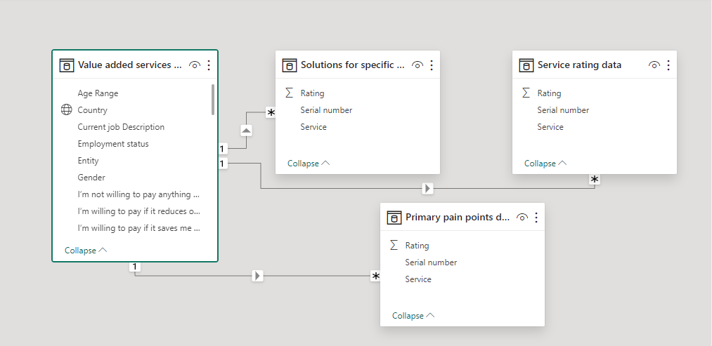   

I then preceeded to create the visualizations to answer my clients questions. I translated the wealth of the data insights into a dynamic and engaging report that not only answered my clients' key questions but also provided an immersive experience. The report design incorporated strategically placed tiles offering quick snapshots of pertinent statistics, ensuring at-a-glance comprehension of critical information.

To facilitate a deeper understanding, I integrated filters, allowing stakeholders to navigate through layers of data effortlessly. This feature enabled the extraction of more nuanced insights, catering to the specific queries and interests of our clients.

The visualizations themselves were not just static representations but interactive elements that invited users to embark on a journey of exploration. By fostering a seamless transition from high-level overviews to granular details, these visuals facilitated a comprehensive understanding of the complexities surrounding merchants' preferences for Value-Added Services (VAS). 
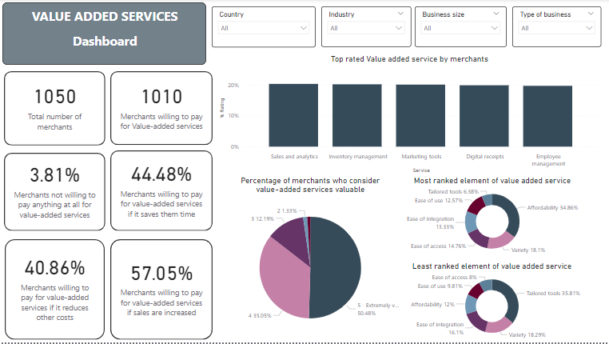   
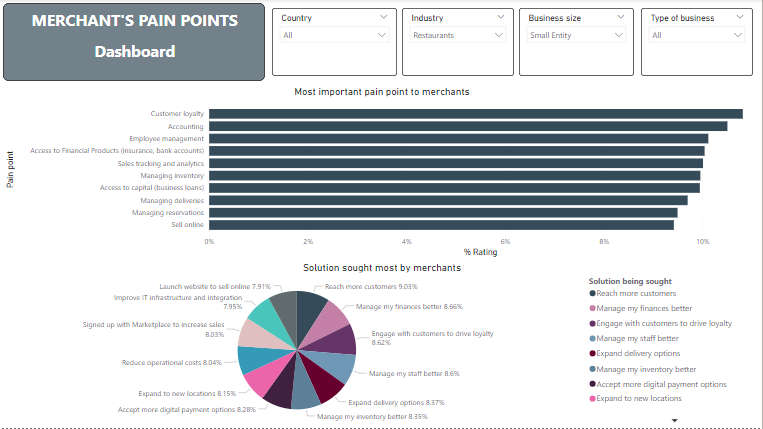   
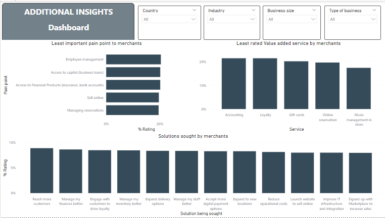   

In conclusion, this project represents a significant milestone in uncovering the intricate landscape of merchants' preferences and challenges surrounding Value-Added Services (VAS). Through meticulous data wrangling using Python and the subsequent creation of a visually striking, informative, and interactive Power BI report, I have navigated through the complexities of the dataset to extract meaningful insights.

The outcomes of this project provided a solid foundation for enhancing my client's value proposition, strengthening his market competitiveness, and potentially uncovering new revenue streams. The blend of analytical rigor, technical proficiency, and the creation of a visually impactful report positions this project as a valuable resource for shaping the trajectory of my client's company in response to the ever-evolving landscape of merchant preferences and challenges in the realm of Value-Added Services.